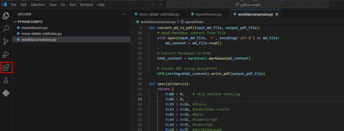
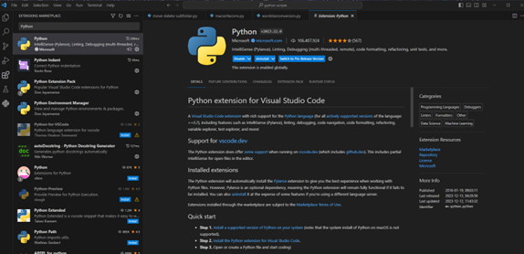
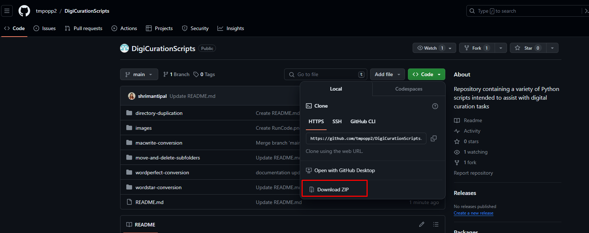
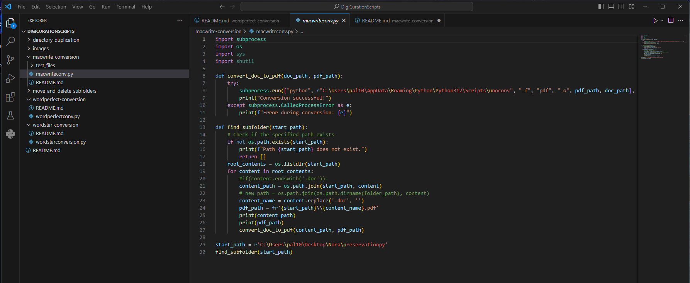
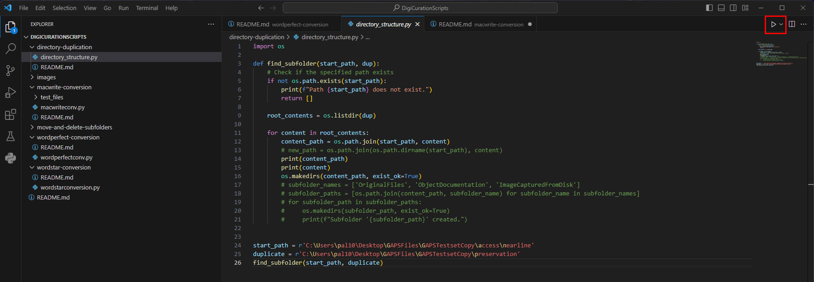

# DigiCurationScripts
Repository containing a variety of Python scripts intended to assist with digital curation tasks 

### Setup Visual Studio Code

Visual Studio Code is a lightweight but powerful source code editor which runs on your desktop and is available for Windows, macOS and Linux.

**VS Code Download Link:** https://code.visualstudio.com/download

**Install Python (the latest stable version) on your PC:** https://www.python.org/downloads/

**VS Code Python extension:**

Go to the extensions section in VS Code (highlighted icon in the sidebar).

### Cloning the GitHub repository:

On the main branch of the repository, click on the green 'Code' button, and then 'Download ZIP Folder':

Once you download all the files in the repository to your PC, extract all the files to a designated folder in your PC to create a local copy of the repository (right click on the ZIP folder > "Extract All"). Launch VS Code and go to File > Open Folder (top left) and then open up the folder on VS Code:

Navigate to the Python script you wish to test/run. Make sure that the name of the file ends with ".py" (eg. as illustrated above, macwriteconv.py)

To run a script, click on the triangle icon at the top right corner of the screen of the VS Code Editor:

