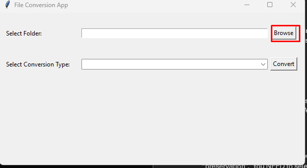
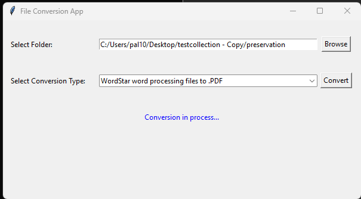

This is an interface for the combined conversions script that I created. It serves as a conversion tool for performing the following types of file conversions:

-	WordStar to PDF
-	WordPerfect to PDF
-	MacWrite to PDF
-	Lotus 1-2-3 Spreadsheets to Excel Spreasheets
-	WAV Audio Files to MP3 Audio Files

### Limitations and Requirements:
Please note that for this tool to work, you need to have your collection folders in a folder called “preservation”.  You NEED to select a “preservation” folder from your PC for it to work. In case you do not have a preservation folder, this can be done by copying or moving the existing folders that contain the files you wish to convert to a new folder called “preservation”.
Due to the various external libraries required for the script to run, it was very difficult to create a working executable file. So please note that for this tool to work, you need to have Python installed in your PC. Refer to the documentation in the first page of the repository for instructions on setting up Python and pip in your system. Make sure the Python extension for VS Code is also installed (detailed in the main README page).
 
Once you have ensured Python and VSCode are installed in your system, open up the script called “install.py” and run it on VSCode (the run button is a triangle icon on the top right side of the VS Code interface).

After the “install.py” script has been run (which installs the required dependencies in your system), go to the file called “conversions.py” and run it. Running it should launch an interface in your system in a new window.
[!NewInterface](../images/newinterface.png)

Click on the browse button:

Make sure you choose a folder that is called “preservation” for the tool to work. My suggestion is if you do not have an existing preservation folder, to create a new one to put your other files/folder in it.

Next, click on the drop down to choose one of the conversion options, and click on the Convert button.

The conversion process is initiated, and may take a long time to terminate depending on the size of the collection. You can view the VS Code terminal logs to see if the conversions are occurring as intended.

Once the conversion is complete, a message is shown. Exit the application for the script to finish running and a conversion log to get created. (For each new conversion type, relaunch the application).

When you navigate to your collection now, you will see an “access” subfolder containing a subfolder called “nearline” which has an exact duplication of the “preservation” folder containing the converted output files in the designated subfolders. The “ObjectDocumentation” folder contains a detailed conversion log with the file name, original file path, new file path (output), file conversion details, time of original file creation, and time of new file creation. The original file creation date may or may not be accurate (depending on if the file that underwent conversion is the original file or a copy of it).

For any issues, contact: pal10@illinois.edu

